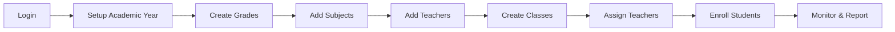
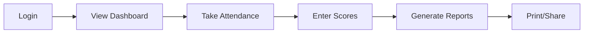

<div align="center">

# 🎓 KruDesk

### School Management System for Cambodian Primary Schools

**កម្មវិធីគ្រប់គ្រងសាលារៀន** សម្រាប់សាលាបឋមសិក្សានៅកម្ពុជា


[Features](#-features) • [Tech Stack](#-tech-stack) • [Installation](#-installation) • [Usage](#-usage) • [Structure](#-project-structure)

</div>

---

## 📖 About the Project

**KruDesk** is a comprehensive **school management system** designed specifically for **Cambodian primary schools**. It provides a modern, mobile-friendly interface to streamline daily school operations including student management, attendance tracking, score entry, and official report generation.

The system follows Cambodian educational standards including the local academic calendar (October–September), Khmer grading scale, and government-approved report formats.

---

## ✨ Features

<table>
<tr>
<td width="50%" valign="top">

### 👥 User Management
- 🛡️ Admin & Teacher roles
- 📱 QR code login support
- 🔐 Role-based permissions
- 👤 Profile with photo upload

### 🎒 Student Management
- ➕ Add/Edit/Archive students
- 📸 Photo upload with preview
- 🚻 Gender-based filtering
- 🔍 Search by name or ID
- 👨‍👩‍👧 Guardian information
- 🗃️ Archive & restore system

### 📅 Attendance System
- ✅ Daily attendance marking
- 4️⃣ Four status types:
  - ✅ Present (វត្តមាន)
  - ❌ Absent (អវត្តមាន)
  - ⏰ Late (យឺត)
  - 📝 Excused (មានច្បាប់)
- 📊 Live statistics dashboard
- 🔒 Auto-lock past dates
- 🚫 Sunday blocking

</td>
<td width="50%" valign="top">

### 📊 Score Management
- 📝 Monthly assessments (12 months)
- 📅 Semester assessments
- ⌨️ Keyboard navigation
- 📈 Live progress tracking
- 🎯 0-10 grading scale
- 🔒 Admin lock/unlock control

### 📈 Reports
- 📋 **Score List** (តារាងស្រង់ពិន្ទុ)
- 🏆 **Ranking** (តារាងចំណាត់ថ្នាក់)
- 🎖️ **Honor Roll** (តារាងកិត្តិយស)
- 🖨️ Print-optimized layouts
- 📄 A4 paper size
- 🇰🇭 Cambodian standard format

### 📆 Academic Calendar
- 12 months per academic year
- October → September cycle
- Semester 1: Oct–Mar (6 months)
- Semester 2: Apr–Sep (6 months)

### 🎨 Modern UI
- 📱 Mobile-first design
- ⚡ Real-time feedback
- 🎨 Consistent design system
- 🌐 Bilingual (Khmer + English)

</td>
</tr>
</table>

---

## 🛠 Tech Stack

<table>
<tr>
<td valign="top">

### Backend
- **Laravel 13** — PHP framework
- **PHP 8.4** — Server language
- **MySQL 8** — Database
- **Eloquent ORM** — Data layer
- **Laravel Breeze** — Authentication

</td>
<td valign="top">

### Frontend
- **Blade** — Templating engine
- **Tailwind CSS 3** — Styling
- **Alpine.js 3** — Reactivity
- **Tabler Icons** — Icon library
- **Vite** — Asset bundler

</td>
<td valign="top">

### Tools
- **Composer** — PHP packages
- **npm** — JS packages
- **Git** — Version control
- **Herd** — Local dev server

</td>
</tr>
</table>

---

## 🎯 Grade Scale (Khmer Standard)

<div align="center">

| Score Range | Khmer Grade | English | Color |
|:-----------:|:-----------:|:-------:|:-----:|
| **9.00 – 10.00** | ល្អណាស់ | Excellent | 🟢 |
| **8.00 – 8.99** | ល្អ | Very Good | 🔵 |
| **7.00 – 7.99** | ល្អបង្គួរ | Good | 🟠 |
| **6.00 – 6.99** | មធ្យម | Average | 🟡 |
| **5.00 – 5.99** | ខ្សោយ | Weak | 🟠 |
| **0.00 – 4.99** | ធ្លាក់ | Fail | 🔴 |

</div>

---

## 📅 Academic Calendar

<div align="center">

| Semester | Months | Period |
|:--------:|:------:|:------:|
| **Semester 1** | 6 months | October – March |
| **Semester 2** | 6 months | April – September |

**Total:** 12 monthly exams + 2 semester exams per year

</div>

---

## 🚀 Installation

### Prerequisites

```bash
PHP >= 8.4
Composer >= 2.x
Node.js >= 20.x
MySQL >= 8.0
```

### Setup Steps

```bash
# 1️⃣ Clone the repository
git clone https://github.com/Sophireak/student-management-system.git
cd student-management-system

# 2️⃣ Install PHP dependencies
composer install

# 3️⃣ Install Node dependencies
npm install

# 4️⃣ Setup environment
cp .env.example .env
php artisan key:generate

# 5️⃣ Configure database in .env
# DB_DATABASE=krudesk
# DB_USERNAME=root
# DB_PASSWORD=

# 6️⃣ Run migrations and seed data
php artisan migrate --seed

# 7️⃣ Create storage symlink (for photos)
php artisan storage:link

# 8️⃣ Build frontend assets
npm run build

# 9️⃣ Start development server
php artisan serve
```

### 🔐 Default Credentials

```
👤 Administrator
   Email:    admin@school.edu.kh
   Password: password

```

---

## 📱 Usage

### Admin Workflow



### Teacher Workflow



---

## 📂 Project Structure

```
student-management-system/
│
├── 📁 app/
│   ├── 📁 Helpers/
│   │   ├── AcademicCalendar.php    ⭐ Cambodia calendar logic
│   │   └── ScoreHelper.php         ⭐ Grade calculations
│   │
│   ├── 📁 Http/Controllers/
│   │   ├── 📁 Admin/               🛡️ Admin controllers
│   │   │   ├── DashboardController.php
│   │   │   ├── StudentController.php
│   │   │   ├── ScoreController.php
│   │   │   ├── ReportController.php
│   │   │   └── ... (12 more)
│   │   │
│   │   └── 📁 Teacher/             👩‍🏫 Teacher controllers
│   │       ├── DashboardController.php
│   │       ├── ScoreController.php
│   │       └── ... (5 more)
│   │
│   └── 📁 Models/                  💾 Database models
│       ├── Student.php
│       ├── Teacher.php
│       ├── SchoolClass.php
│       ├── Enrollment.php
│       ├── Attendance.php
│       ├── MonthlyScore.php
│       └── ... (10 more)
│
├── 📁 database/
│   ├── 📁 migrations/              📊 Table structures
│   └── 📁 seeders/                 🌱 Sample data
│
├── 📁 resources/
│   └── 📁 views/
│       ├── 📁 admin/               🛡️ Admin views
│       ├── 📁 teacher/             👩‍🏫 Teacher views
│       ├── 📁 components/          🧩 Reusable components
│       └── 📁 layouts/             🎨 Base layouts
│
└── 📁 routes/
    ├── admin.php                   🛡️ Admin routes
    └── teacher.php                 👩‍🏫 Teacher routes
```

---

## 🎨 Design System

### Color Palette

<table>
<tr>
<td align="center" width="16%">
🟢<br>
<b>Primary</b><br>
<code>green-600</code>
</td>
<td align="center" width="16%">
🔵<br>
<b>Info</b><br>
<code>blue-600</code>
</td>
<td align="center" width="16%">
🟡<br>
<b>Warning</b><br>
<code>amber-600</code>
</td>
<td align="center" width="16%">
🔴<br>
<b>Danger</b><br>
<code>red-600</code>
</td>
<td align="center" width="16%">
🟣<br>
<b>Accent</b><br>
<code>purple-600</code>
</td>
<td align="center" width="16%">
⚪<br>
<b>Neutral</b><br>
<code>gray-100</code>
</td>
</tr>
</table>

### Typography

- **Base Font:** System UI stack
- **Khmer Font:** Battambang, Khmer OS
- **Title Font:** Moul (for Khmer titles)

---

## 🌟 Technical Highlights

<table>
<tr>
<td width="50%" valign="top">

### 🏗️ Architecture
- ✅ Consolidated controllers
- ✅ Reusable Blade components
- ✅ Central helper classes
- ✅ Resource-style routing
- ✅ Role-based middleware

### 🎨 UI/UX
- ✅ Mobile-first responsive
- ✅ Toast notifications
- ✅ Live progress tracking
- ✅ Keyboard navigation
- ✅ Print optimization

</td>
<td width="50%" valign="top">

### 🔒 Security
- ✅ CSRF protection
- ✅ SQL injection prevention
- ✅ Role permissions
- ✅ Data validation
- ✅ File upload security

### 📊 Data Integrity
- ✅ Auto-lock past periods
- ✅ Transaction handling
- ✅ Soft delete for students
- ✅ Cascade relationships
- ✅ Audit trail (entered_by)

</td>
</tr>
</table>

---

## 📊 Project Statistics

<div align="center">

| Metric | Count |
|:------:|:-----:|
| 📁 **Controllers** | ~20 |
| 📄 **Blade Views** | ~80+ |
| 💾 **Models** | ~15 |
| 🗄️ **Database Tables** | ~30 |
| 🧩 **Reusable Components** | 10+ |
| 🛣️ **Routes** | ~50 |

</div>

---

## 🎓 Academic Project

This project was developed as a **4th year graduation project** to demonstrate:

<table>
<tr>
<td width="50%" valign="top">

### 💡 Skills Demonstrated
- ✅ Full-stack development
- ✅ Database design
- ✅ UI/UX principles
- ✅ Git version control
- ✅ Project planning

</td>
<td width="50%" valign="top">

### 🎯 Problem Solved
- ✅ Manual paper-based tracking
- ✅ Slow report generation
- ✅ Difficult data analysis
- ✅ No mobile access
- ✅ Language barriers

</td>
</tr>
</table>

---

## 🔮 Future Enhancements

- [ ] 📧 Email notifications for parents
- [ ] 📊 Advanced analytics dashboard
- [ ] 💾 PDF/Excel export
- [ ] 📱 Native mobile app
- [ ] 🌐 Multi-school support
- [ ] 🔄 Real-time sync
- [ ] 💬 Parent-teacher chat
- [ ] 📸 SMS notifications

---

## 📄 License

This project is developed for **academic purposes only** as part of a graduation requirement.

---

## 🙏 Acknowledgments

<table>
<tr>
<td width="33%" align="center">

**🇰🇭 Cambodia MoEYS**<br>
For educational standards<br>
and grading system

</td>
<td width="33%" align="center">

**🚀 Laravel Community**<br>
For excellent framework<br>
and documentation

</td>
<td width="33%" align="center">

**🎨 Design Community**<br>
Tailwind CSS, Tabler Icons,<br>
Alpine.js teams

</td>
</tr>
</table>

---

<div align="center">

### 🇰🇭 Made with ❤️ in Cambodia

**KruDesk** — Modernizing school management, one classroom at a time.

⭐ **Star this repository if you find it helpful!**

</div>